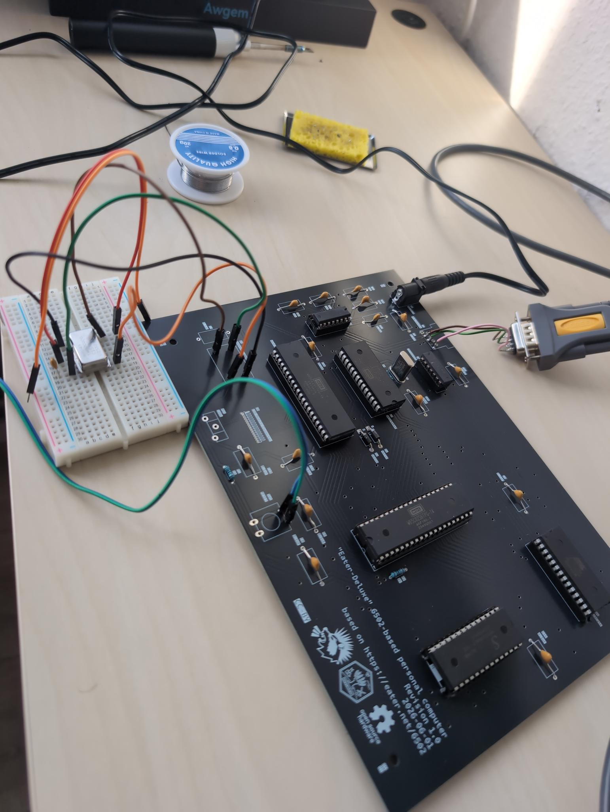
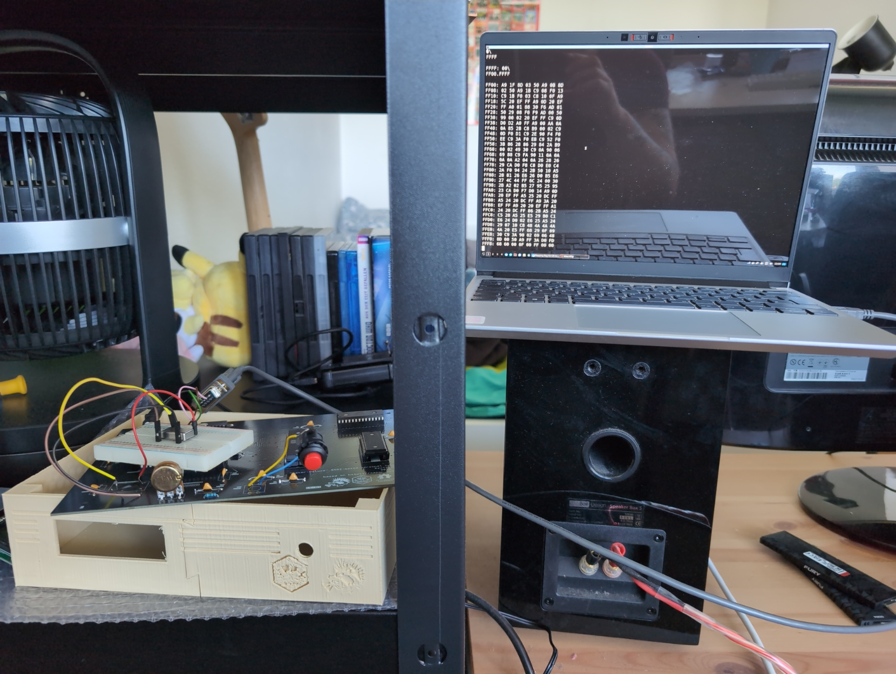

# eater-deluxe - a retro computer from the modern times

A 6502-based personal computer with 32K of SRAM, an LCD Display and
an RS232 Serial interface, based on [Ben Eater's 6502 Breadboard Computer](https://eater.net/6502)

It is compatible with all software running on the breadboard 6502 computer.

## Dependencies for the KiCAD Project

[6502 KiCAD Library](https://github.com/Alarm-Siren/6502-kicad-library)

## Errata

### Revision 1.0

- The clock pinout is messed up. If you already have a revision 1.0 board, solder
  single pin headers in to make it easier to connect up the clock can
- LCD footprint is too small. You can still try to solder in some wires, but this
  was initially intended for pin headers, so your mileage may vary.
- Interrupt lines are missing pullup resistors. Should still work unmodified if
  you don't use these, otherwise you need to wire botch wires instead.
